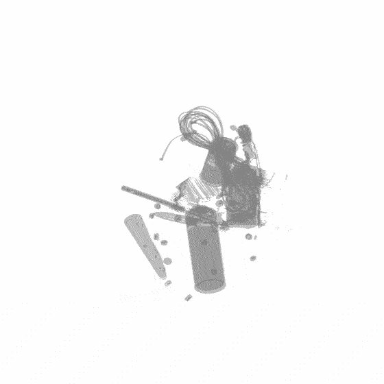
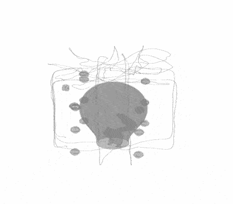
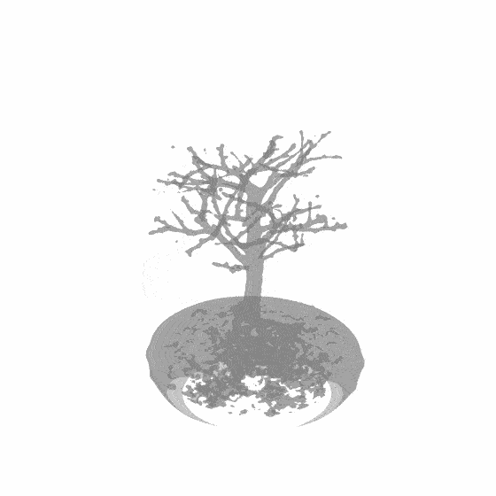
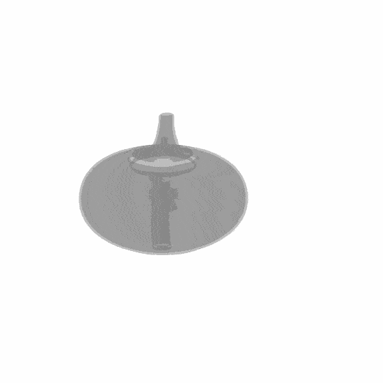
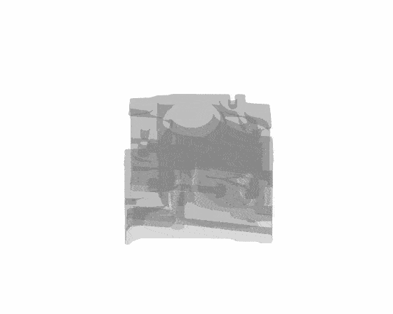
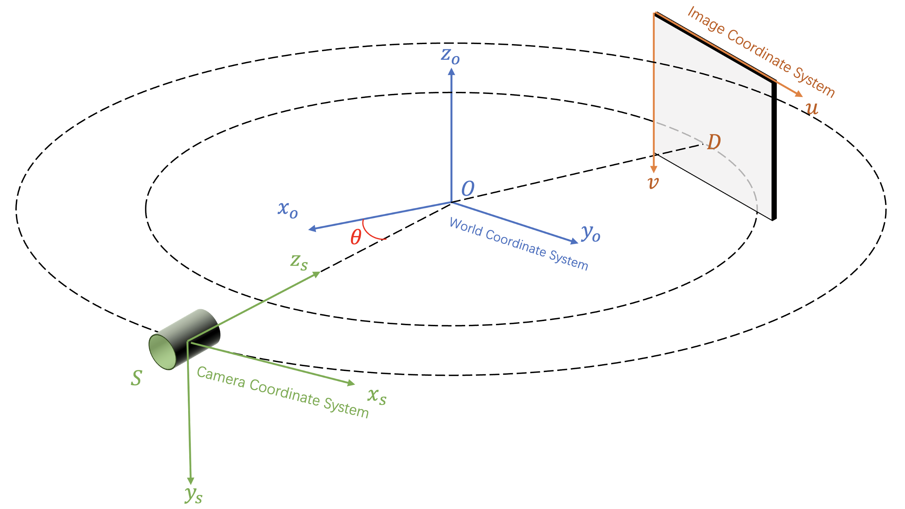

&nbsp;

<div align="center">
<p align="center">  </p>

[](https://arxiv.org/abs/2311.10959)
[](https://zhuanlan.zhihu.com/p/702702109)
[](https://www.youtube.com/watch?v=oVVUaBY61eo)

&nbsp;

<h2> A Toolbox for Sparse-View X-ray 3D Reconstruction </h2> 


    


  &emsp; &emsp;  


</div>


&nbsp;

### Introduction
This repo is a comprehensive toolbox and library for X-ray 3D reconstruction including two tasks, novel view synthesis (NVS) and computed tomography (CT) reconstruction. This repo supports 11 state-of-the-art methods including six NeRF-based methods, two 3DGS-based methods, two optimization-based methods, and one analytical method. We also provide code for fancy visualization such as turntable video and data generation to help your research. If you find this repo useful, please give it a star ⭐ and consider citing our paper. Thank you.


### News
- **2025.09.18 :** Our new work [CARE](https://arxiv.org/abs/2506.02093) for diffusion based Anatomy-aware enhancement of sparse-view CT reconstruction has been accepted by NeurIPS 2025. Congrats to [Tianyu](https://lin-tianyu.github.io/). Code and models have been released at [this repo](https://github.com/MrGiovanni/CARE). 🍒
- **2025.06.25 :** Our new work [X2-Gaussian](https://arxiv.org/abs/2503.21779) for dynamic human chest breathing CT reconstruction has been accepted by ICCV 2025. Congrats to [Weihao](https://yuyouxixi.github.io/). Code and models will be released at [this repo](https://github.com/yuyouxixi/x2-gaussian).  🚀
- **2024.09.25 :** Our new work [R2-Gaussian](https://arxiv.org/abs/2405.20693v1) has been accepted by NeurIPS 2024. Congrats to [Ruyi](https://ruyi-zha.github.io/). Code and model will be released at [this repo](https://github.com/Ruyi-Zha/r2_gaussian). 💫 
- **2024.09.01 :** Code of our ECCV 2024 work [X-Gaussian](https://github.com/caiyuanhao1998/X-Gaussian/) has been released. Welcome to have a try! 🚀
- **2024.07.09 :** Our SAX-NeRF has been added to the [Awesome-Transformer-Attention](https://github.com/cmhungsteve/Awesome-Transformer-Attention/blob/main/README_2.md) collection 💫
- **2024.06.16 :** I will present this work in person. Our poster session is from 10:30 am to 00:30 pm, Jun 20 at Arch 4A-E Poster #147. Welcome to chat with me in Seattle Convention Center. :satisfied:
- **2024.06.16 :** More raw data and generation samples are provided. Feel free to use them. 
- **2024.06.03 :** Code for traditional methods has been released. 🚀
- **2024.06.03 :** Code for fancy visualization and data generation has been released. 🚀
- **2024.06.02 :** Data, code, models, and training logs have been released. Feel free to use them :)
- **2024.03.07 :** Our new work [X-Gaussian](https://github.com/caiyuanhao1998/X-Gaussian), the first 3DGS-based method for X-ray imaging, is now on [arxiv](https://arxiv.org/abs/2403.04116) now. Code, models, and training logs will be released at [this repo](https://github.com/caiyuanhao1998/X-Gaussian). Stay tuned. 💫
- **2024.02.26 :** Our paper has been accepted by CVPR 2024. Code and pre-trained models will be released to the public before the start date of CVPR 2024 (2024.06.19). Stay tuned! :tada: :confetti_ball:
- **2023.11.21 :** The benchmark of X3D at the [paper-with-code website](https://paperswithcode.com/dataset/x3d) has been set up. You are welcome to make a comparison. 🚀
- **2023.11.21 :** Our paper is on [arxiv](https://arxiv.org/abs/2311.10959) now. We will develop this repo into a baseline for X-ray novel view synthesis and CT reconstruction. All code, models, data, and training logs will be released. 💫

### Performance

<details close>
<summary><b>Novel View Synthesis</b></summary>


</details>


<details close>
<summary><b>CT Reconstruction</b></summary>


</details>


<details open>
<summary><b>Supported algorithms:</b></summary>

* [x] [SAX-NeRF](https://arxiv.org/abs/2311.10959) (CVPR 2024)
* [x] [X-Gaussian](https://arxiv.org/abs/2403.04116) (ECCV 2024)
* [x] [R2-Gaussian](https://arxiv.org/abs/2405.20693v1) (NeurIPS 2024)
* [x] [X2-Gaussian](https://arxiv.org/abs/2503.21779) (ICCV 2025)
* [x] [CARE](https://arxiv.org/abs/2506.02093) (NeurIPS 2025)
* [x] [TensoRF](https://arxiv.org/abs/2203.09517) (ECCV 2022)
* [x] [NAF](https://arxiv.org/abs/2209.14540) (MICCAI 2022)
* [x] [NeAT](https://arxiv.org/abs/2202.02171) (ACM TOG 2022)
* [x] [NeRF](https://arxiv.org/abs/2003.08934) (ECCV 2020)
* [x] [InTomo](https://openaccess.thecvf.com/content/ICCV2021/papers/Zang_IntraTomo_Self-Supervised_Learning-Based_Tomography_via_Sinogram_Synthesis_and_Prediction_ICCV_2021_paper.pdf) (ICCV 2021)
* [x] [SART](https://engineering.purdue.edu/RVL/Publications/SART_84.pdf) (Ultrasonic imaging 1984)
* [x] [ASD-POCS](https://www.researchgate.net/profile/Emil-Sidky/publication/23169511_Image_reconstruction_in_circular_cone-beam_computed_tomography_by_constrained_total-variation_minimization/links/0c96052408b0814590000000/Image-reconstruction-in-circular-cone-beam-computed-tomography-by-constrained-total-variation-minimization.pdf) (Physics in Medicine & Biology 2008)
* [x] [FDK](https://opg.optica.org/josaa/fulltext.cfm?uri=josaa-1-6-612&id=996) (Josa a 1984)

</details>


### Coordinate System

The coordinate system in circular cone-beam X-ray scanning follows the OpenCV standards. The transformation between the camera, world, and image coordinate systems is shown below.
<div align="center">
<p align="center">  </p>
</div>

&nbsp;

## 1. Create Environment:

We recommend using [Conda](https://docs.conda.io/en/latest/miniconda.html) to set up an environment.

``` sh
# Create environment
conda create -n sax_nerf python=3.9
conda activate sax_nerf

# for users that don't have CUDA-11.3 on their server and
# don't have sudo permission to install, please install CUDA-11.3 in conda environment
# otherwise you can skip these steps
conda install -c nvidia/label/cuda-11.3.1 cuda cudnn cuda-nvcc	# install CUDA-11.3 (and all needed pkg) for conda environment
ln -s $CONDA_PREFIX/lib $CONDA_PREFIX/lib64	# softlink to solve a TIGRE version/path check issue
conda install -c conda-forge gcc=10 gxx=10	# only support gcc <= 10

# Install pytorch (hash encoder requires CUDA v11.3)
pip install torch==1.11.0+cu113 torchvision==0.12.0+cu113 torchaudio==0.11.0 --extra-index-url https://download.pytorch.org/whl/cu113

# Install other packages
pip install -r requirements.txt
```

We suggest you install TIGRE toolbox (2.3 version) for executing traditional CT reconstruction methods and synthesize your own CT data if you plan to do so. Please note that TIGRE v2.5 might stuck when CT is large.
``` sh
# Download TIGRE
wget https://github.com/CERN/TIGRE/archive/refs/tags/v2.3.zip
unzip v2.3.zip
rm v2.3.zip

# Install TIGRE
pip install cython==0.29.25
pip install numpy==1.21.6
cd TIGRE-2.3/Python/
python setup.py develop
```

&nbsp;

## 2. Prepare Dataset:

Download our processed datasets from [Google drive](https://drive.google.com/drive/folders/1SlneuSGkhk0nvwPjxxnpBCO59XhjGGJX?usp=sharing) or [Baidu disk](https://pan.baidu.com/s/18zc6jHeNvoUNAF6pUaL9eQ?pwd=cyh2). Then put the downloaded datasets into the folder `data/` as

```sh
  |--data
      |--chest_50.pickle
      |--abdomen_50.pickle
      |--aneurism_50.pickle
      |--backpack_50.pickle
      |--bonsai_50.pickle
      |--box_50.pickle
      |--carp_50.pickle
      |--engine_50.pickle
      |--foot_50.pickle
      |--head_50.pickle
      |--leg_50.pickle
      |--pancreas_50.pickle
      |--pelvis_50.pickle
      |--teapot_50.pickle
      |--jaw_50.pickle
```

&nbsp;

## 3. Testing:

You can directly download our pre-trained models from [Google drive](https://drive.google.com/drive/folders/1wlDrZQRbQENcfW1Pjrr1gasFQ8v6znHV?usp=sharing) or [Baidu disk](https://pan.baidu.com/s/1FlQJQRYJ7ApjCrxcTrF5mQ?pwd=cyh2). Then put the downloaded models into the folder `pretrained/` and run

```sh
# SAX-NeRF
python test.py --method Lineformer --category chest --config config/Lineformer/chest_50.yaml --weights pretrained/chest.tar --output_path output 

# FDK
python3 eval_traditional.py --algorithm fdk --category chest --config config/FDK/chest_50.yaml

# SART
python3 eval_traditional.py --algorithm sart --category chest --config config/SART/chest_50.yaml

# ASD_POCS
python3 eval_traditional.py --algorithm asd_pocs --category chest --config config/ASD_POCS/chest_50.yaml
```
For your convenience, we provide the reconstructed results in [Google drive](https://drive.google.com/drive/folders/1kKGHRrabdbKQeKBLxK5tj8VqVipEvOW5?usp=sharing) and [Baidu disk](https://pan.baidu.com/s/1_S9BRTthsf7y96cBIWTJmw?pwd=cyh2).

&nbsp;

## 4. Training:

We provide the training logs on all scenes for your convenience to debug. Please download the training logs from [Google dive](https://drive.google.com/drive/folders/123WISBBc3rjfKqZ1EGK0-2sW5TY5dkLI?usp=sharing) or [Baidu disk](https://pan.baidu.com/s/18NP2R215cU3op4mI3bQqug?pwd=cyh2).

```sh
# SAX-NeRF
python train_mlg.py --config config/Lineformer/chest_50.yaml

# NeRF
python train.py --config config/nerf/chest_50.yaml

# Intratomo
python train.py --config config/intratomo/chest_50.yaml

# NAF
python train.py --config config/naf/chest_50.yaml

# TensoRF
python train.py --config config/tensorf/chest_50.yaml
```

You can use [this repo](https://github.com/darglein/NeAT) to run NeAT. Remember to reprocess the data first.

&nbsp;

## 5. Visualization

To render a cool demo, we provide visualization code in the folder `3D_vis`

```sh
cd 3D_vis
python 3D_vis_backpack.py
python 3D_vis_backpack_gif.py
```

&nbsp;

## 6. Generate Your Own Data
We also provide code for data generation in the folder `dataGenerator`. To give you a quick start, we provide the raw data for your debugging. Please download the raw data from [Google dive](https://drive.google.com/drive/folders/1i3BhyftggTj1SqW6Ibl5tWTWD0VLc7ex?usp=sharing) or [Baidu disk](https://pan.baidu.com/s/19mgQFBtDdfhjY4kkRGOmow?pwd=cyh2) and then put them into the folder `dataGenerator/raw_data`. Run

```sh
cd dataGenerator
python data_vis_backpack.py
cd ..
python dataGenerator/generateData_backpack.py
```

&nbsp;

## 7. Citation
If this repo helps you, please consider citing our works:


```sh
# SAX-NeRF
@inproceedings{sax_nerf,
  title={Structure-Aware Sparse-View X-ray 3D Reconstruction},
  author={Yuanhao Cai and Jiahao Wang and Alan Yuille and Zongwei Zhou and Angtian Wang},
  booktitle={CVPR},
  year={2024}
}

# X-Gaussian
@inproceedings{x_gaussian,
  title={Radiative gaussian splatting for efficient x-ray novel view synthesis},
  author={Yuanhao Cai and Yixun Liang and Jiahao Wang and Angtian Wang and Yulun Zhang and Xiaokang Yang and Zongwei Zhou and Alan Yuille},
  booktitle={ECCV},
  year={2024}
}

# R2-Gaussian
@inproceedings{r2_gaussian,
  title={R2-Gaussian: Rectifying Radiative Gaussian Splatting for Tomographic Reconstruction},
  author={Ruyi Zha and Tao Jun Lin and Yuanhao Cai and Jiwen Cao and Yanhao Zhang and Hongdong Li},
  booktitle={NeurIPS},
  year={2024}
}

# X2-Gaussian
@inproceedings{x2_gaussian,
  title={X2-Gaussian: 4D Radiative Gaussian Splatting for Continuous-time Tomographic Reconstruction},
  author={Yu, Weihao and Cai, Yuanhao and Zha, Ruyi and Fan, Zhiwen and Li, Chenxin and Yuan, Yixuan},
  booktitle={ICCV},
  year={2025}
}

# CARE
@inproceedings{lin2025pixel,
  title={Are Pixel-Wise Metrics Reliable for Sparse-View Computed Tomography Reconstruction?},
  author={Lin, Tianyu and Li, Xinran and Zhuang, Chuntung and Chen, Qi and Cai, Yuanhao and Ding, Kai and Yuille, Alan L and Zhou, Zongwei},
  booktitle={NeurIPS},
  year={2025}
}
```
