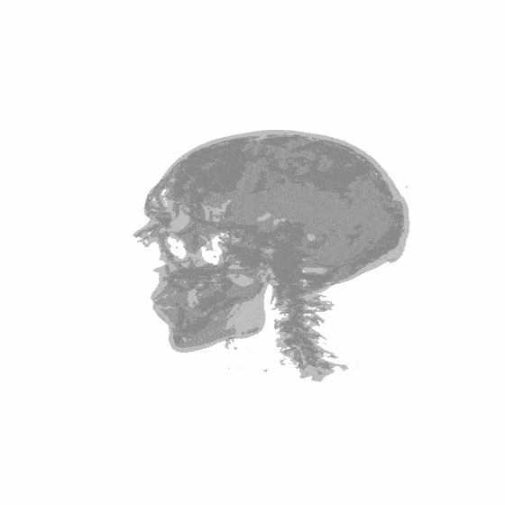
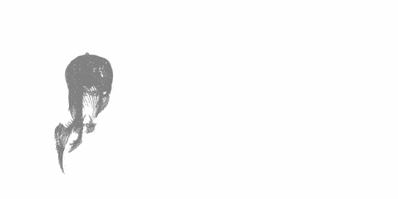
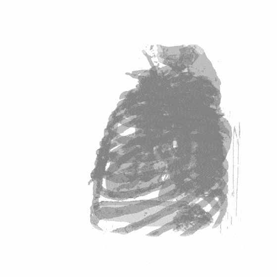
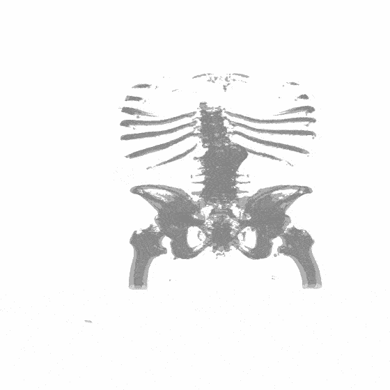

&nbsp;

  

<h2>Structure-Aware Sparse-View X-ray 3D Reconstruction </h2> 

   

  &emsp; &emsp;  

     

&nbsp;

### News
- **2023.11.21 :** Our paper is on [arxiv](https://arxiv.org/abs/2311.10959) now. We will develop this repo into a baseline for X-ray novel view synthesis and CT reconstruction. Code, models, and data will be released. 💫
